# Velocity

A self-hosted, keyless situation console: live aircraft, ships, satellites,
GPS jamming, dark vessels, TFR airspace, military bases, naval warnings,
earthquakes, outages and conflict events, fused on one 3D globe and correlated
on the server instead of leaving you to eyeball six tabs.

The part that's genuinely hard to find elsewhere: it keeps history *you* own.
Flightradar24 gates replay at 7 days free, MarineTraffic cut its free window
to 24 hours, ADS-B Exchange killed its free API tier outright — a self-hosted
tool just doesn't have that problem. Turn on the archive profile and Velocity
keeps recording position history to your own disk for as long as you give it
room, with a scrubber to rewind to any past moment. No account, no API key,
nobody who can paywall, filter or cut off your archive.

And once you've found something worth keeping, it stays evidence: a
chain-of-custody **evidence locker** hashes every capture (a URL snapshot, an
upload, a feed freeze) with SHA-256 and an append-only custody log, then rolls a
case up into a self-contained **HTML / PPTX report** where every claim carries
its provenance. All of it keyless, all of it on your disk.

It also runs as an MCP server, so an AI agent can query the same live feeds
instead of guessing from its training cut-off — everything it returns is
labelled as automated output, not sold as "AI insight."

**[Live demo](https://projectvelocity.org)** · [Quick start](#quick-start) · [The apps](#the-apps) · [Take the tour](#take-the-tour) · [Query it from an AI agent](#mcp-server-query-the-live-console-from-an-ai-agent)

[](./LICENSE)
[](https://github.com/AndrewCTF/velocity/releases/latest)
[](#tests)
[](#what-it-pulls-in)

<p align="center">
  
</p>
<p align="center"><i>One take, real data: the live world → Europe → click an aircraft → its dossier and owned track → rewind the last hour.</i></p>

The short version, against the trackers you already use (free tiers, as of
July 2026):

|  | History you can replay | Self-hosted | Account / API key | Who owns the archive |
|---|---|---|---|---|
| **Velocity** | Unlimited — bounded by your disk, scrubbable to any past moment | Yes | None | You |
| Flightradar24 | 7 days on the free tier | No | Account | Them |
| MarineTraffic | 24 hours free (down from 72) | No | Account | Them |
| ADS-B Exchange | Free API tier discontinued | No | Paid API | Them |

Live coverage is the same community feeder data everywhere; the columns above
are the paywall. Each cell is checkable on the vendors' own pricing pages.

> **Before you get excited:** it's a single-analyst tool. Live *derived* state —
> the current incident list, AOI selections, watch-officer briefs — lives in
> memory and clears on restart; what you deliberately keep is durable (see
> [Scope and limits](#scope-and-limits)): the position-history archive, the
> local ontology store (objects, case files, situations) and the evidence
> locker's custody chain all persist to disk. AIS is densest over Northern
> Europe (global coverage is sparser and terrestrial-biased), and the 3D
> satellite mode is a VRAM hog.

> **Use at your own risk.** No warranty; the authors take no responsibility for
> your use of this tool or the data it pulls. Velocity scrapes third-party
> sources that have not authorised it — **their** terms bind **you**, the
> requests come from **your** IP, and rate limits, bans, and legal exposure are
> yours to absorb. Feeds are often incomplete, delayed, or spoofed, and the AI
> summaries can be confidently wrong. Not for safety-of-life, navigation, or any
> use where being wrong hurts someone. Read [`DISCLAIMER.md`](./DISCLAIMER.md)
> before you run it.

## Prerequisites

Honestly, not much. There are two ways to run it, pick whichever you're set up for:

- **The easy way, with Docker.** If you have Docker (24 or newer, with the
  `compose` plugin that ships with Docker Desktop), that's the whole list. One
  command and you're up.
- **Running the pieces yourself.** If you'd rather not use Docker, you'll need
  Node 20+, pnpm 9 (`corepack enable` picks the right version for you), Python
  3.12 for the backend, and `uv` to pull its dependencies. A plain venv works too
  if you don't have `uv`.

Either way, you need a browser that can do WebGL2, so any recent Chrome, Edge or
Firefox. The globe leans on your GPU, so on a laptop with switchable graphics do
yourself a favour and push it onto the discrete card before you judge the frame
rate.

And no keys. The core feeds (planes, ships, quakes, satellites, the basemap) all
run without a single API key. Keys only ever add reach; see
[What it pulls in](#what-it-pulls-in) for what each one buys you.

## Quick start

Docker is the short road. It brings up the API, the web app and nginx together:

```bash
git clone https://github.com/AndrewCTF/velocity.git
cd velocity
cp .env.example .env       # optional, leave it empty and it still works
docker compose up          # api + web + nginx on :8080
```

Now open <http://localhost:8080>. It comes up live, planes moving, ships,
quakes, the lot, with nothing to configure in between — and position history
is already recording to a Docker volume, so it's still there the next time you
run `docker compose up` (set `ARCHIVE_MODE=1` in `.env` for an open-ended
archive instead of the default rolling window; see
[Scope and limits](#scope-and-limits)). The first time in, a short tour points
out where things live; you can pull it back up whenever from **⚙ Settings**.

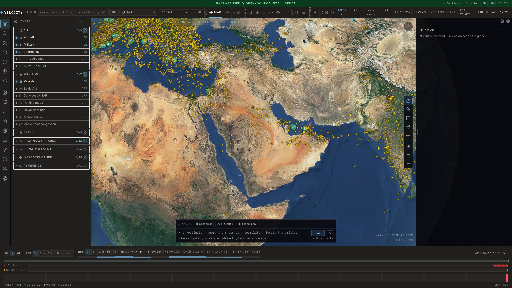

That strip along the bottom is the archive — here it reads *recording since
yesterday · 2.3 GB · 12.7 million fixes*. Drag it back an hour, a day, as far as
your history goes, and the globe rewinds to that exact moment.

> **Local (open) mode.** The compute-heavy endpoints — the LLM-backed Reports
> tabs, recon, and OSINT enrichment — *fail closed* on a keyless box so a
> public deployment can't be made to spend GPU/credits by an anonymous caller.
> The dev `docker compose up` sets `ALLOW_UNAUTHENTICATED=1` for you (the stack
> is loopback-only), so those features work out of the box and the UI shows an
> open-mode banner. Configure `API_KEY` or Supabase in `.env` and real auth
> takes over (the flag becomes irrelevant). For an internet-facing box use
> `docker-compose.prod.yml`, which leaves the flag unset. The globe, replay,
> evidence capture, and all keyless feeds never needed the flag.

<details>
<summary><b>Local dev without Docker</b></summary>

```bash
make install                                      # pnpm install + api venv
cd apps/api && .venv/bin/uvicorn app.main:app     # backend on :8000
pnpm dev                                          # vite on :5173, proxies /api to localhost:8000
```

Set `VITE_API_URL` if the backend isn't on `http://localhost:8000`. If you set
`API_KEY` on the backend, build the web app with a matching `VITE_API_KEY`; it
rides along as `X-API-Key` on every call.
</details>

## The apps

Velocity isn't one mega-dashboard; it's a workspace of twelve apps that all
share the same selection and time context, so switching never loses the object
you had selected. The top bar groups them:

| Group | Apps | What they're for |
| --- | --- | --- |
| **Live** | Map · Sim | The Cesium globe (always mounted behind everything else) and a browser war-game overlay. |
| **Analyze** | Explorer · Graph · Investigate · Targeting · Video · Country | Filter the live object store, grow a link-analysis graph, run digital OSINT (domains/people/wallets), a notional kill-chain board, FMV/ground recon, and per-country World-Bank/UN stat dossiers. |
| **Data** | Foundry · Workflows | Bring your own data through governed pipelines; automate the live feeds with a node-graph editor. |
| **Product** | Reports | Case files, watch-officer briefs, dossiers, and case→report export. |
| **3D** | City 3D | Gaussian-splat city scenes built from a keyless satellite AOI. |

The rest of this README tours the ones you'll live in. Everything below is a
real screenshot of the current build (v0.9.2), not a mockup.

## Take the tour

**1. The whole planet, live.** Thousands of aircraft plus vessels, satellites,
quakes and more on one Cesium globe. Every aircraft and ship renders as its
category icon, coloured and rotated to its heading; dense areas cluster into
count badges you can drill into.

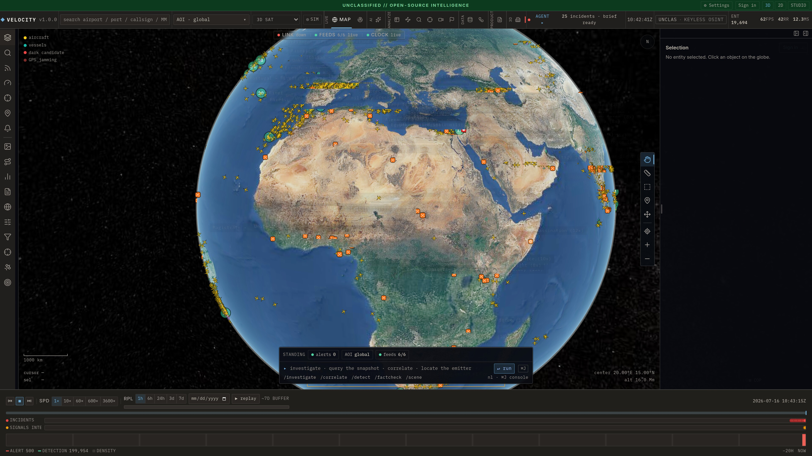

**2. Zoom anywhere, toggle everything.** Drag into a region and traffic, labels
and coastlines fill in. The left rail is the whole intel stack in one tree — air,
maritime, space, ground hazards, signals and 14 infrastructure layers — each
with its live count. A right-side map toolbar adds the analyst verbs on top of
the globe: **measure** a running great-circle distance, **area-select** a box
and search every object inside it, **annotate** with dropped markers, or **move**
a marker — plus one-click camera reset and zoom.

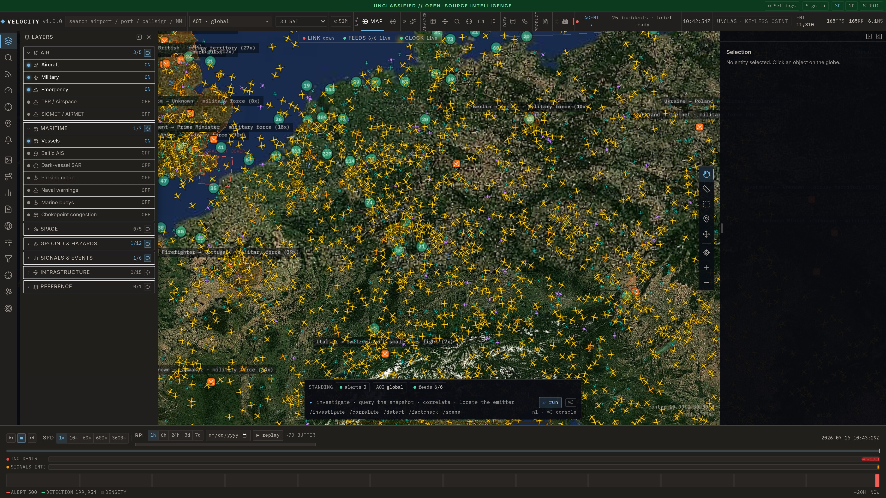

**3. Click anything.** Select an aircraft or vessel and the right panel fills
with its dossier: identity, kinematics, the flight/route, ACARS, a
pattern-of-life baseline, GPS integrity and the raw fields — while a magenta
line traces its recent track on the globe. An **AI assessment** block (labelled,
and grounded in the observed track) summarises what the dossier fields imply.
Click empty space and it all clears.

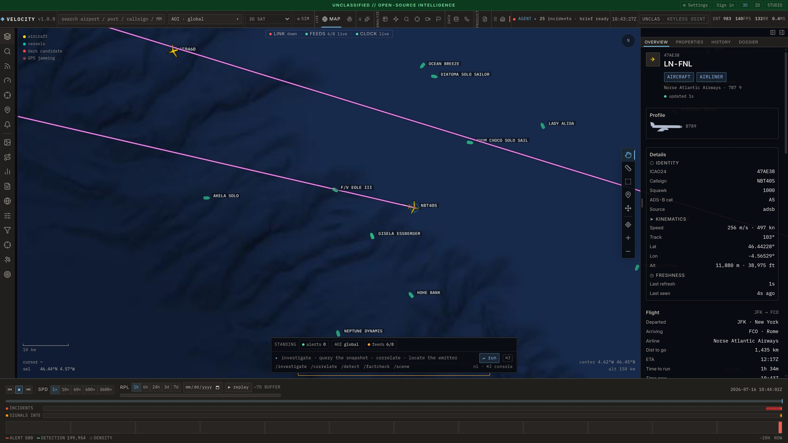

**4. Or query the whole store at once.** The Explorer app is every live object
in one filterable, sortable table — tens of thousands of tracks across vessels,
aircraft and quakes, each tagged with the feed it came from and how long ago it
was seen. Facet it, save the search, export the result to CSV.

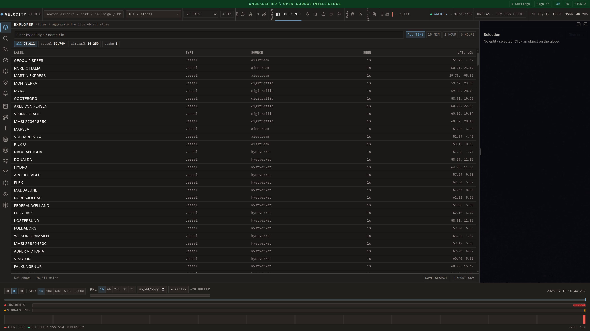

**5. Chokepoints and AOIs, watched continuously.** A curated library of the
world's maritime chokepoints — Hormuz, Bab-el-Mandeb, Malacca, the Taiwan
Strait, the English Channel, undersea-cable corridors — each with live transit
counts and the daily oil-flow figures that make it matter. Standing detections
fire against them in the background.

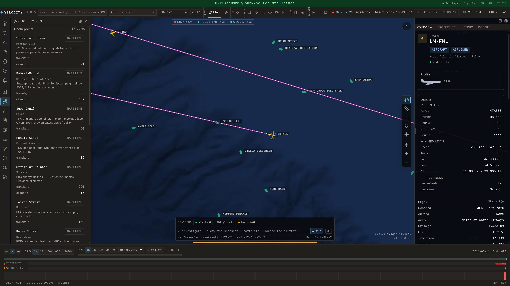

**6. Airspace, bases, ports and airports — operational context, still keyless.**
Toggle the TFR/Airspace layer and live FAA temporary flight restrictions draw as
real polygons, coloured by reason with their altitude bands. Alongside them:
7,183 military bases (air, naval and army, from Wikidata), NGA NAVAREA broadcast
warnings with mine areas flagged, 3,804 ports from the NGA World Port Index
(harbour size and type, shelter, repairs, dry dock, pier and channel depths),
and airports enriched with runways (length, surface, lighting, per-end ILS
category from FAA NASR), tower/ground/ATIS frequencies, live METAR with flight
category, and a LiveATC linkout. A basemap picker swaps between eight keyless
map styles (Esri imagery/topo/dark, OpenTopoMap, USGS, Sentinel-2 cloudless…),
each probed live before it's offered.

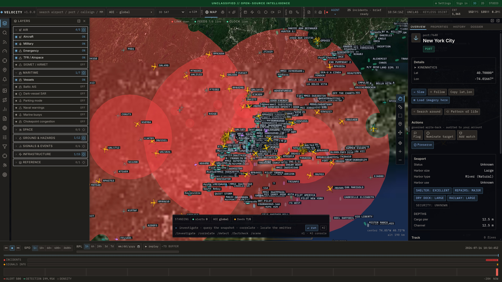

**7. Space, with real physics.** ~16k satellites from CelesTrak, propagated
in-browser with actual SGP4 orbital mechanics and enriched from SATCAT with
owner, launch date, radar cross-section and orbit class.

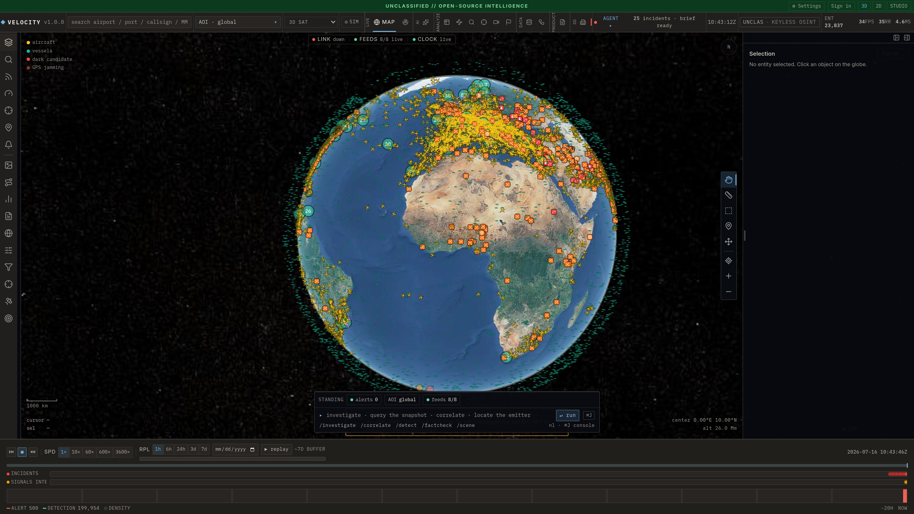

**8. The watch officer works the inbox.** An autonomous watch officer fuses
jamming, dark vessels, military air activity and conflict events into ranked,
cited alerts — GPS spoofing, jamming cells, dark-vessel candidates — each with an
`[inferred]` reasoning line and a one-click *slew to*. It runs `detect_deception`
and `deep_analyze` against the live picture, so the inbox fills itself on a fresh
keyless boot with no operator setup.

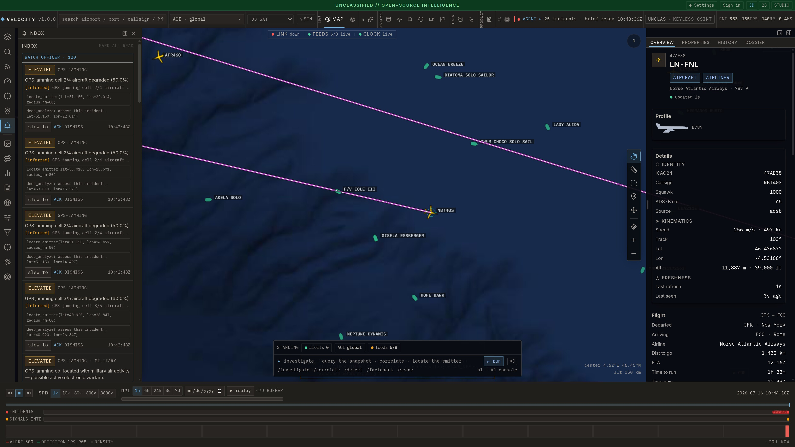

**9. …and writes the brief.** Every couple of minutes it promotes the
convergences — "vessels went dark near reported activity", "spoofed tracks
co-located with an AIS gap" — into ranked incident cards with a written, cited
summary and a *slew to* button. Actionable incidents are auto-promoted into the
investigation graph, so the ontology grows itself.

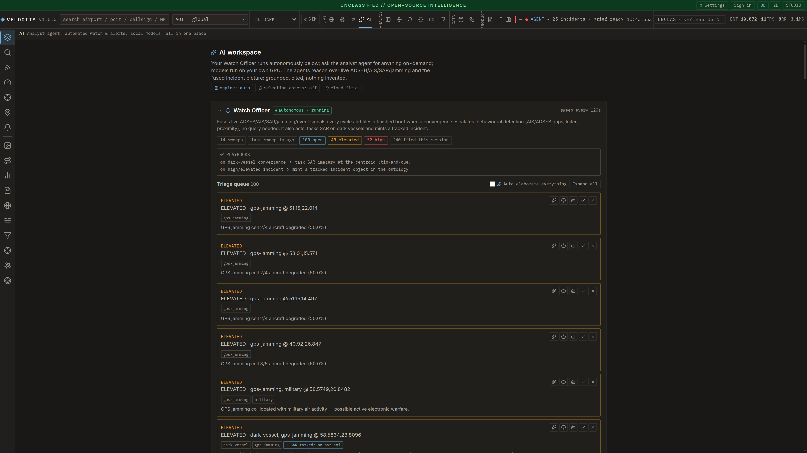

**10. Keep it as evidence.** Anything worth keeping goes into the
chain-of-custody **evidence locker**: capture a URL snapshot, upload a file, grab
a screenshot, or freeze the current feed state, and each artifact is hashed with
SHA-256, written to `./data/evidence`, and logged to an append-only custody
chain in the local ontology store. Attach it to a situation, re-verify the hash
any time, or roll a whole case into a signed hash-of-hashes manifest. Fully
keyless. From there, **Reports** exports the case (see [Export](#export)) as a
JSON bundle, a self-contained HTML report with per-claim provenance footnotes,
or a PPTX brief — with any AI narrative confined to a clearly labelled block.

**11. Tear the workspace apart.** Any right-rail panel detaches into a
free-floating, draggable, resizable window over the globe — put the dossier on
one screen, the layer tree on another, keep the map clear. Positions persist for
the session.

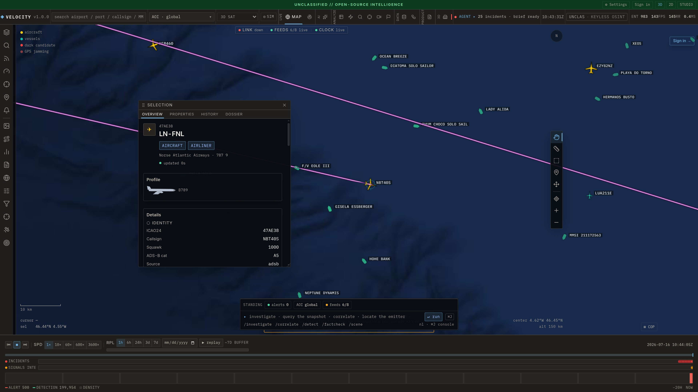

**12. Bring your own data — the Foundry tab.** Upload a CSV/JSON/NDJSON, shape it
through a governed pipeline (13 transform steps: filter, derive, join, aggregate,
union, window, pivot, dedup, cast, sort…), gate every version with data-health
checks (freshness SLAs, schema-drift, uniqueness…), and bind it into the same
ontology graph as the live feeds. Lineage, immutable versions with rollback, and
a dead-letter for rows that fail a transform all come along; the pipeline graph
flags exactly which outputs went stale.

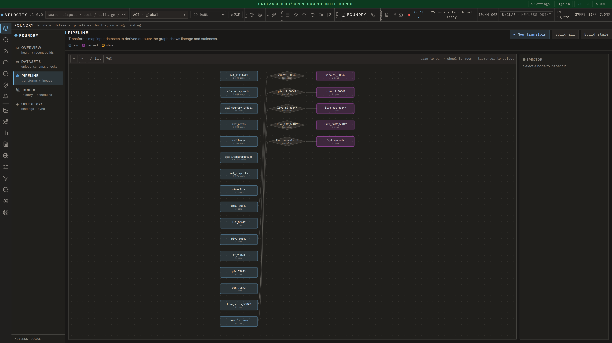

**13. Automate it — the Workflows tab.** A node-graph editor over the same live
feeds and ontology: wire sources (aircraft, vessels, quakes, alerts, datasets,
ontology, countries) through sandboxed Python/SQL/LLM transform blocks into sinks
(alerts, ontology objects, datasets, persistent memory), then run it on a
schedule. Control blocks can reach outward too — webhooks to your own server, or
a MAVLink bridge for drone tasking that rehearses log-only without a vehicle.

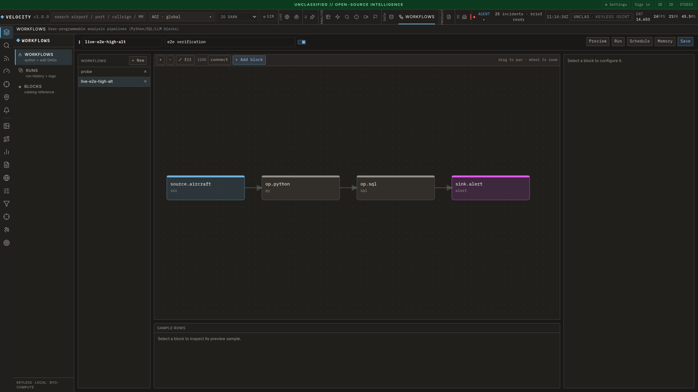

## Scope and limits

The point is fusion. Plenty of sites already do one feed well: Flightradar24 for
planes, MarineTraffic for ships, [GPSJam](https://gpsjam.org) for jamming.
Velocity goes after the seam between them: AIS plus radar imagery flags a ship
that's switched its transponder off; a cluster of aircraft reporting bad GPS
integrity becomes a jamming hotspot; when two or more of those line up in the
same place and time, they get promoted to a single incident with a written,
cited summary.

A few things worth knowing up front, because I'd rather you read them here than
be annoyed later:

- It's built for one analyst. One optional API key, no accounts or roles.
- **What persists vs what clears.** Durable on disk: the position-history
  archive (SQLite at `./data/history.db`), the local ontology store — ontology
  objects, case files, situations (`intel/ontology_local.py`) — and the evidence
  locker (blobs under `./data/evidence`, custody chain in the ontology store's
  append-only `assertions` table). Volatile, and cleared on backend restart: the
  live incident list, transient AOI selections, and generated watch-officer
  briefs. The Docker Compose volumes mean the durable stores survive
  `docker compose down`, not just a process restart. The dev compose sets
  `HISTORY_RETENTION_HOURS=48` (2 days) out of the box; set `ARCHIVE_MODE=1` (the
  production compose profile does, with a 5 GB starting budget via
  `HISTORY_DISK_BUDGET_GB`) to size the archive against your disk instead of a
  fixed time window.
- AIS runs keyless and global (~33k vessels, MMSI-deduped across ShipXplorer,
  MyShipTracking, Digitraffic and Kystverket), but coverage is densest over
  Northern Europe and the Baltic and thins out elsewhere; an AISStream key fills
  in the gaps. Sparse regions still lean on the radar (SAR) layer.
- **The two headless-Chrome sidecars are degraded under Docker, not crashed.**
  ADS-B (OpenSky + the httpx tar1090 mirrors + ShipXplorer AIS) and the
  regional Kystverket/Digitraffic AIS feeds are direct HTTP calls and run at
  full strength in the container. But the tar1090 ADS-B sidecar and
  MyShipTracking (the enabled primary keyless *wide-area* AIS source) drive a
  real Chromium via Node, which the slim API image doesn't ship — they log a
  warning and sit idle rather than crash the backend, so you lose their extra
  coverage, not the app. Run bare-metal (`bash scripts/run-api.sh`) for full
  sidecar coverage.
- Some **Analyze** apps are notional by design — the Targeting kill-chain board
  and the Video/FMV sensor HUD carry a "NOTIONAL // SIMULATED" banner and are
  driven by the Sim overlay, not a live weapons or ISR feed.
- The 3D satellite view will eat your VRAM. The default 2D dark map runs on a
  laptop; check [System requirements](#system-requirements) before switching the
  heavy mode on.

None of it needs an API key to start. Keys only add reach.

## What it pulls in

Rough live numbers off a running backend; they move around through the day:

| Feed | Typical live count | Where it comes from |
| --- | --- | --- |
| Aircraft (ADS-B) | 9–13k (~11k typical) | OpenSky + airplanes.live |
| Military aircraft | ~140 | adsb.lol |
| Vessels (AIS) | ~33k, global | ShipXplorer + MyShipTracking + Digitraffic + Kystverket |
| GPS jamming | ~200 flagged 1° cells | ADS-B NACp/NIC, the GPSJam method |
| Dark vessels | radar change-detection | Sentinel-1 SAR |
| Fused incidents | correlation-driven | the correlation engine |
| Satellites | ~16k, SATCAT-enriched | CelesTrak |
| Airspace (TFRs) | live restriction polygons | FAA |
| Military bases | 7,183 (+1,330 MIRTA/Wikidata) | Wikidata + DIA MIRTA |
| Naval broadcast warnings | ~800 plotted points | NGA NAVAREA |
| Ports | 3,804, with harbour detail | NGA World Port Index |
| Airports | runways + ILS + frequencies + live METAR | FAA NASR, NOAA, LiveATC |
| Earthquakes | ~250/day | USGS + EMSC |
| News + fact-check | ~370 articles | publisher RSS |
| Internet outages | country level | IODA, Cloudflare |
| Submarine cables | ~700 | TeleGeography |
| Conflict events | ~1.5k live | GDELT, EONET, ACLED |
| Wildfires | VIIRS hotspots | NASA FIRMS (needs a key) |
| 3D war damage, imagery, webcams | varies | Sentinel, GIBS, OSM |
| Per-country toolkits | 53 countries | open-data / registries / sanctions links |

Optional keys, if you want more reach: AISStream for global AIS, an OpenSky
login for a bigger ADS-B budget, `FIRMS_MAP_KEY` for fires, an ACLED key for
conflict events, `CLOUDFLARE_TOKEN` for outages. `GET /api/intel/sources`
reports what's actually live versus what's still waiting on a key.

## MCP server: query the live console from an AI agent

The part I think is genuinely new: the backend doubles as a **Model Context
Protocol** server, so an AI agent can interrogate the same warm feeds the globe
renders without scraping a dozen sites or flooding its own context. Ask "where
is GPS being jammed right now?" and it answers from the live feed. Full
architecture + `/api/intel/*` HTTP reference: [`docs/mcp-server.md`](./docs/mcp-server.md).
It exposes 34 tools over `app.mcp_server` (a representative slice below; run
`--list-tools` for the full set):

| Tool | What it returns |
| --- | --- |
| `get_situation` | Global summary: aircraft by category, GNSS-degraded count, emergencies, worst jamming cells, vessel/alert counts. The cheap first call. |
| `focus_area(lat,lon,radius_nm)` | **Loads a region PRIMARY** (dedicated fresh `/v2/point` fetch + ongoing priority refresh, independent of global rate limits) and returns a full bundle: aircraft + density + GPS jamming + vessels + fused anomalies. |
| `aircraft_density` | Grid of cells (count, by category, GNSS-degraded) for an area. |
| `gps_jamming` | GPSJam-method assessment (ADS-B NACp<8 / NIC<7, 1° bins): flagged cells, severity, affected aircraft. Global or scoped. |
| `query_aircraft` | Filtered query (bbox/centre, category, squawk, callsign, altitude band, emergency / gnss_degraded / on_ground). |
| `lookup_aircraft(ident)` | One aircraft by ICAO24 or callsign + integrity/threat assessment. |
| `query_vessels` | AIS vessels in an area, classified; `dark_only` for dark-vessel candidates. |
| `anomalies` | Fused report: emergencies, jamming hotspots, dark vessels, alerts + a triage threat level. |
| `detect_deception` / `locate_emitter` | Flag spoofed/co-located tracks; triangulate a jamming source from degraded-integrity aircraft. |
| `whats_changed` / `incident_history` | Delta since a timestamp; the incident timeline for an area. |
| `deep_analyze(question, lat?, lon?)` | Gathers the relevant intel JSON and has a **reasoning model** reason over it (DeepSeek when configured, else a local Ollama model), so heavy analysis stays off the agent's context and only the conclusion returns. |

Every tool returns compact, bounded JSON (counts, grids, ≤50-item samples), so
an agent can sweep the planet for a few hundred tokens instead of pulling 15k
features. Heavy tools also take **`detail='short'`** (the default digest — top-N
of each list plus a `<field>_total`) or **`detail='long'`** (the full bundle), so
an agent sweeps in `short` and drills in `long`. Area-primary loading means the
agent's region of interest stays fresh and dense even while the global firehose is
being rate-limited; the rest of the world keeps streaming from the sticky snapshot.

The same fusion powers the in-app **AI selection brief**: click an entity and
`POST /api/ai/selection/brief` fuses its registry enrichment and pattern-of-life
dossier into a selection-tier model prompt for a Gotham-style inference — every
claim cites the dossier field it came from, and it degrades to the raw props if
no model is configured.

### Install as a Claude Code plugin (skill + commands + agent)

The repo is also a Claude Code **plugin marketplace**. One install wires the MCP
server *plus* an analyst skill (`osint-intel`), slash commands (`/osint-brief`,
`/osint-watch`, `/osint-jamming`), and a `osint-watch-officer` agent. Start the
backend (`bash scripts/run-api.sh`), then in Claude Code:

```
/plugin marketplace add /path/to/OSINT
/plugin install osint-geoint@osint-velocity
```

Set **repo_dir** and **python** (the repo's venv interpreter) when prompted; the
plugin runs that Python directly, so it works on Windows, macOS, and Linux. The
installer prints the exact commands for your OS: `bash
plugin/osint-geoint/install.sh` (Linux/macOS, `-y` to register the MCP server) or
`plugin\osint-geoint\install.ps1` (Windows, `-Run` to register).

### Hosted: point your agent at the live endpoint

On the hosted platform the MCP server is mounted into the backend at `/mcp`
(streamable-HTTP), so there's nothing to install or run. Register it with any
MCP client using your Velocity access token:

```bash
claude mcp add --transport http osint-geoint \
  https://projectvelocity.org/mcp \
  --header "Authorization: Bearer $VELOCITY_TOKEN"
```

`$VELOCITY_TOKEN` is your signed-in Velocity (Supabase) access token; the
gateway Worker verifies it and the backend re-checks it, so the endpoint is
gated to your session.

### Self-host / develop

```bash
# 1. backend must be running (provides the warm feeds)
uv run --project apps/api uvicorn app.main:app --port 8000

# 2a. MCP server over stdio (Claude Code / Desktop / Agent SDK), cross-platform
uv run --project apps/api python -m app.mcp_server
# 2b. or streamable-HTTP
uv run --project apps/api python -m app.mcp_server --http --port 8765
# introspect (no backend needed)
uv run --project apps/api python -m app.mcp_server --list-tools
```

To register the local stdio server with Claude Code, run from the repo root:

```bash
claude mcp add osint-geoint -- uv run --project apps/api python -m app.mcp_server
```

`uv run` resolves the right interpreter on Linux, macOS, and Windows without
hardcoding a venv path. No `uv`? Point it at the venv Python directly:
`apps/api/.venv/bin/python -m app.mcp_server` (Linux/macOS) or
`apps\api\.venv\Scripts\python.exe -m app.mcp_server` (Windows), run from
`apps/api`.

Config (env or `apps/api/.env`): `API_BASE`, `API_KEY`, `OLLAMA_HOST`,
`OLLAMA_MODEL` (empty picks the smallest installed model; `deep_analyze`
degrades to returning raw JSON if Ollama is absent). The MCP server never
crashes a tool call: backend down returns a structured `backend_unreachable`
error; Ollama down falls back to raw intel JSON.

## Export

Two ways out, for two jobs:

**The live picture.**
`GET /api/export?fmt=geojson|csv|kml&kinds=aircraft,vessels&bbox=min_lon,min_lat,max_lon,max_lat&limit=N`
downloads the current snapshot the globe renders as **GeoJSON** (QGIS /
kepler.gl / Leaflet), **CSV** (spreadsheets), or **KML** (Google Earth). `bbox`
clips to a viewport; `kinds` is comma-separated (default `aircraft`); `limit`
caps features; vessels are best-effort.

**A finished case.**
`POST /api/situations/{id}/export?fmt=json|html|pptx` walks a situation's
children, its sourced assertions and every attached piece of evidence into a
shareable artifact: a self-describing **JSON** bundle, a self-contained **HTML**
report with a provenance footnote on each claim, or a **PPTX** brief. Any AI-written
narrative is confined to one labelled block — the rest is your cited evidence.

## System requirements

The heavy component is the **client**, a CesiumJS WebGL2 globe. It is GPU- and
browser-main-thread-bound, and the backend is light. WebGL2 is required
(Chrome/Edge 110+, Firefox 110+). On hybrid-graphics laptops, force the discrete
GPU (`chrome://gpu`, look for adapter "ACTIVE").

**VRAM depends heavily on which mode you run:**

- **2D-dark (default basemap):** light. The globe is a proxied 2D raster basemap
  plus the entity layers (aircraft/vessels). Runs on integrated graphics / ~2–4 GB
  VRAM, which is the right mode for modest hardware.
- **3D-sat (satellite imagery + world terrain + OSM 3D buildings, optional Google
  Photorealistic 3D):** **VRAM-heavy.** CesiumJS streams terrain meshes, high-res
  imagery, and 3D-tile building/photogrammetry sets, and it caches into whatever
  VRAM is available, measured at **20+ GB on a 32 GB card**. Tilesets are now
  individually cache-capped (Google 3D ~1.5 GB, OSM buildings ~0.5 GB) and MSAA is
  off (FXAA instead), but with terrain + global imagery + a high-DPI/4K canvas the
  resident set is still large. On a card with less VRAM, Cesium evicts and
  re-fetches more aggressively (lower fps, more pop-in) and still runs.

| Tier | GPU | RAM | Display | What you get |
|---|---|---|---|---|
| Minimum | WebGL2 integrated (Iris Xe / Vega / M1) | 8 GB | 1080p | 2D-dark, regional zoom, ~30 fps. 3D-sat will be rough. |
| Recommended | Discrete ≥8 GB VRAM (RTX 3060 / RX 6700 / M-Pro) | 16 GB | 1080p–1440p | 2D-dark smooth; 3D-sat usable at city scale. |
| 3D-sat / 4K | RTX 4070+/16 GB VRAM or better | 32 GB | up to 4K | Full 3D-sat terrain + buildings; high fps. |

These tiers come from watching it actually run. 3D-sat genuinely wants a lot of
VRAM, and the low-VRAM minimum only holds for the 2D-dark map; switch on 3D-sat
and you'll want a discrete card with headroom.

**Backend (server):** Python 3.12, ~1 GB RAM, outbound HTTPS. Runs on a small
VPS or the same box, and it isn't the bottleneck.

## Stack

- **Frontend**: Vite + React 18 + TypeScript + CesiumJS + MapLibre GL JS v5.24 + Tailwind + Zustand
- **Backend**: FastAPI (Python 3.12) + httpx + websockets. Live *derived* state
  is in-process (bounded observation store + disk tile cache); durable state —
  the position-track replay archive, the ontology store (objects / case files /
  situations) and the evidence locker's custody chain — persists to SQLite, on
  Docker volumes in Compose, with a rolling window by default or an open-ended
  disk-budgeted archive via `ARCHIVE_MODE`
- **Agent access**: Model Context Protocol server (`app.mcp_server`, MCP SDK) + optional local Ollama analysis
- **Data (Phase 2, planned)**: PostgreSQL 16 + PostGIS + TimescaleDB hypertables + Redis. SQLite backs replay + the ontology today; the observation store migrates per plan §locked-decisions #5
- **Infra**: Docker Compose, nginx reverse proxy

## Layout

```
osint/
├── apps/web/                 # React + Cesium console (12-app workspace)
│   └── src/
│       ├── globe/            # Cesium globe, layers, map toolbar (measure/area/annotate)
│       ├── entity-panel/     # right-rail dossier / inspector
│       ├── evidence/         # chain-of-custody evidence locker UI
│       ├── foundry/          # FOUNDRY surface (datasets, pipeline DAG, builds, ontology)
│       └── shell/            # app switcher + detachable floating panels
├── apps/api/                 # FastAPI backend
│   └── app/
│       ├── intel/            # agent-facing analytics, local ontology store, evidence, case export
│       ├── foundry/          # BYO-data layer: datasets, transforms, builds, checks, binding
│       ├── routes/intel.py   # /api/intel/* deep-query JSON API
│       ├── routes/evidence.py# /api/evidence/* capture / verify / attach / manifest
│       ├── routes/foundry.py # /api/foundry/* datasets/pipelines/checks/bindings
│       └── mcp_server.py     # Model Context Protocol server
├── packages/shared/          # Shared TS types (LayerDescriptor, Observation)
├── docs/                     # design notes, decisions.md, foundry-plan.md
└── infra/                    # Docker, nginx, db init
```

## Tests

```bash
# from the repo ROOT (running from apps/api makes .env auth resolve → a wall of 401s)
OSINT_DISABLE_BACKGROUND=1 apps/api/.venv/bin/pytest apps/api -q   # 1687 passed + 1 skipped
pnpm -r test                          # vitest (web, shared)
pnpm -r typecheck
bash scripts/verify.sh                # typecheck + lint + web unit + api tests in one shot
# manual MCP integration drivers (need backend on :8000):
#   apps/api/.venv/bin/python tests/mcp_client_check.py   # stdio handshake
#   apps/api/.venv/bin/python tests/mcp_full_check.py     # tools end-to-end + Ollama
```

## Phase status

This is the internal build log, in order shipped — not the pitch (that's
above). Legend: ✅ shipped · 🚧 in progress

- ✅ **Phase 0** — Foundation
- ✅ **Phase 1** — MVP: live ADS-B / AIS / quakes / GPS-jamming layers on the globe
- ✅ **Phase 2** — Replay + drill-in. The timeline scrubber and a disk-backed
  history archive ship as SQLite-backed playback (48h rolling window by
  default, or an open-ended disk-budgeted archive with `ARCHIVE_MODE`);
  drilling into any past moment works today. A durable Postgres + PostGIS +
  TimescaleDB store for the rest of the platform's state is a deferred scaling
  upgrade, not a blocker
- ✅ **Phase 3** — Fusion engine + alerts (correlation rules) + 2D mirror
- 🚧 **Phase 4** — Advanced sensors + agent access. MCP server + intel API
  (now with a Claude Code plugin and `detail=short|long` tool variants), Sentinel-1 SAR
  dark-vessel detection, an autonomous watch-officer that writes cited incident
  briefs and auto-populates the ontology graph from them, a keyless
  infra/domain OSINT layer, a places/airspace layer (FAA TFR polygons,
  military bases, NGA naval warnings, World Port Index port detail, NASR/METAR
  airport enrichment, an 8-way keyless basemap picker), a **chain-of-custody
  evidence locker** and **case→report export** (JSON/HTML/PPTX with per-claim
  provenance), a globe map toolbar (measure/area-select/annotate) and detachable
  floating panels, a photo-geolocation pipeline, a City 3D Gaussian-splat viewer,
  optional local-GPU (Ollama) inference, and a first-run onboarding tour. More
  sensors and deeper analysis are ongoing.
- 🚧 **Phase 5** — Foundry: a keyless, local, single-operator take on Palantir
  Foundry's data-integration loop. Upload → transform (governed 13-step DSL with
  lineage) → build (dependency DAG, staleness, cycle rejection) → data-health
  checks → bind into the local ontology graph. In: immutable versions +
  rollback, row-level quarantine/dead-letter, freshness/schema-drift SLAs,
  window/pivot analytics, entity resolution. Deliberately out of scope
  (single-operator identity): multi-tenant MLS, distributed compute, streaming
  CDC, connector catalogs. Next: ontology Actions (audited write-back) and
  dataset branches.
- 🚧 **Phase 6** — Workflows: a node-graph automation layer over the same live
  feeds and ontology. 20 blocks — sources (aircraft, vessels, quakes, alerts,
  datasets, ontology, countries), transforms (`op.python`/`op.sql`/`op.llm`
  sandboxed subprocesses, `op.geo`, `op.http`, `op.steps`), sinks (alert,
  ontology, dataset, persistent memory), and **external-actuation control
  blocks** that reach out of the platform: `control.webhook` to any server, and
  `control.drone`/`control.device` to command a UAV or hardware via a JSON
  envelope. A first-class **MAVLink bridge** (`app.mavlink_bridge`,
  ArduPilot/PX4, log-only without a vehicle so you can rehearse) ships in-repo.
  See [`docs/workflows-control-blocks.md`](./docs/workflows-control-blocks.md).

See [`docs/`](./docs) for the per-feature design notes and pipeline writeups.

## License

[AGPL-3.0-or-later](./LICENSE) covers Velocity's **source code**. Upstream **data
carries its own licenses**; several feeds are non-commercial / academic (e.g.
ACLED, adsb.fi, OpenSky). See [`NOTICE`](./NOTICE) for per-source attribution and
terms, and verify each upstream's current terms before any commercial or
redistributive use.

No warranty, and no liability for how you collect or use the data — see
[`DISCLAIMER.md`](./DISCLAIMER.md), which also covers scraping, upstream terms,
personal data, and prohibited uses.
