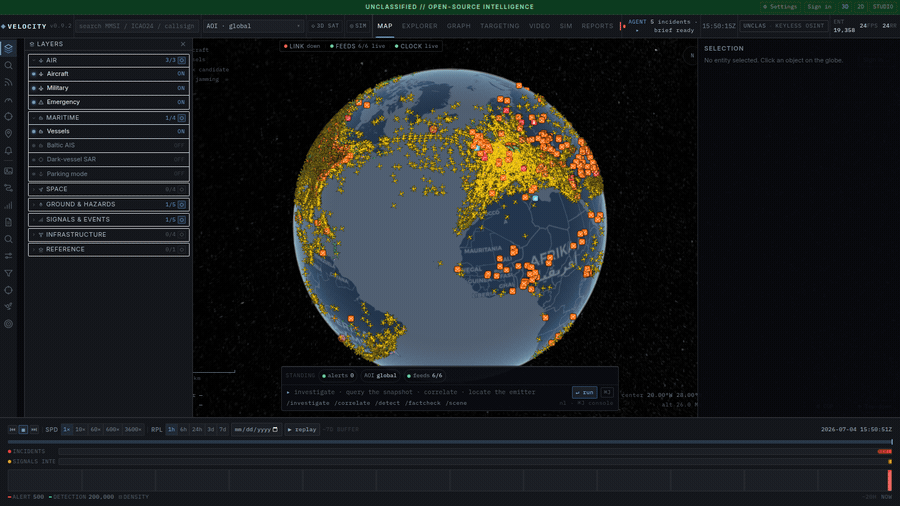
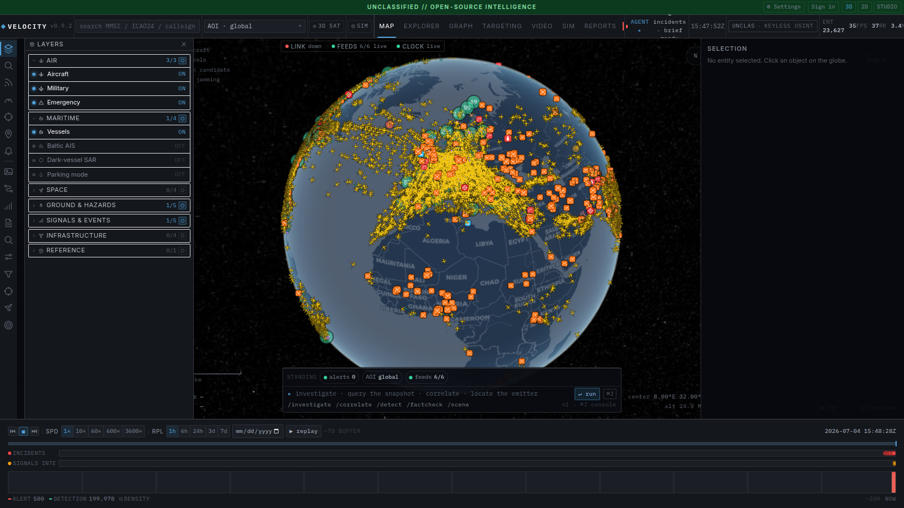
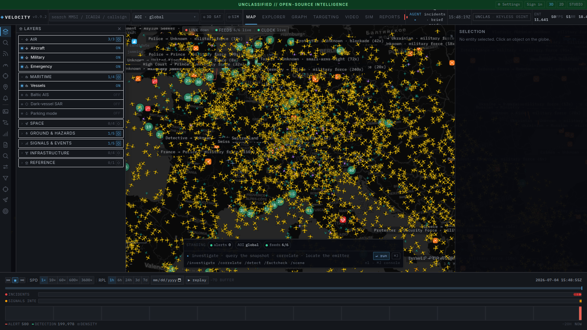
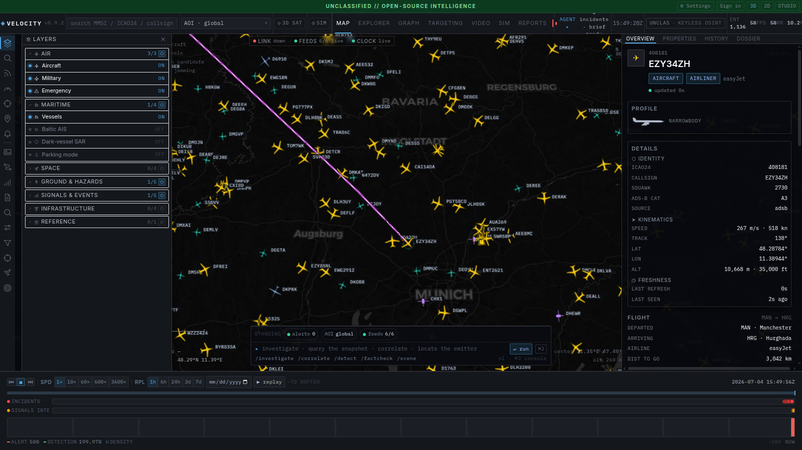

# Velocity

A 3D globe that pulls a stack of open intelligence feeds into one place: live
aircraft, ships, satellites, GPS jamming, dark vessels, earthquakes, internet
outages, conflict events and news. It correlates them on the server instead of
leaving you to eyeball six tabs. It also runs as an MCP server, so an AI agent
can ask it for live data instead of guessing from its training cut-off.

**[Live demo](https://projectvelocity.org)** · [Quick start](#quick-start) · [Take the tour](#take-the-tour) · [Query it from an AI agent](#mcp-server-query-the-live-console-from-an-ai-agent)

[](./LICENSE)
[](#tests)
[](#what-it-pulls-in)

<p align="center">
  
</p>

> **Before you get excited:** it's a single-analyst tool, state lives in memory
> (restart = gone), AIS coverage is mostly Northern Europe, and the 3D satellite
> mode is a VRAM hog. Full caveats in [Scope and limits](#scope-and-limits).

## Prerequisites

Honestly, not much. There are two ways to run it, pick whichever you're set up for:

- **The easy way, with Docker.** If you have Docker (24 or newer, with the
  `compose` plugin that ships with Docker Desktop), that's the whole list. One
  command and you're up.
- **Running the pieces yourself.** If you'd rather not use Docker, you'll need
  Node 20+, pnpm 9 (`corepack enable` picks the right version for you), Python
  3.12 for the backend, and `uv` to pull its dependencies. A plain venv works too
  if you don't have `uv`.

Either way, you need a browser that can do WebGL2, so any recent Chrome, Edge or
Firefox. The globe leans on your GPU, so on a laptop with switchable graphics do
yourself a favour and push it onto the discrete card before you judge the frame
rate.

And no keys. The core feeds (planes, ships, quakes, satellites, the basemap) all
run without a single API key. Keys only ever add reach; see
[What it pulls in](#what-it-pulls-in) for what each one buys you.

## Quick start

Docker is the short road. It brings up the API, the web app and nginx together:

```bash
git clone https://github.com/AndrewCTF/ProjectVelocity.git
cd ProjectVelocity
cp .env.example .env       # optional, leave it empty and it still works
docker compose up          # api + web + nginx on :8080
```

Now open <http://localhost:8080>. It comes up live, planes moving, ships,
quakes, the lot, with nothing to configure in between. The first time in, a
short tour points out where things live; you can pull it back up whenever from
**⚙ Settings**.

<details>
<summary><b>Local dev without Docker</b></summary>

```bash
make install                                      # pnpm install + api venv
cd apps/api && .venv/bin/uvicorn app.main:app     # backend on :8000
pnpm dev                                          # vite on :5173, proxies /api to localhost:8000
```

Set `VITE_API_URL` if the backend isn't on `http://localhost:8000`. If you set
`API_KEY` on the backend, build the web app with a matching `VITE_API_KEY`; it
rides along as `X-API-Key` on every call.
</details>

## Take the tour

**1. The whole planet, live.** Thousands of aircraft plus vessels, satellites,
quakes and more on one Cesium globe. Every aircraft and ship renders as its
category icon, coloured and rotated to its heading.



**2. Zoom anywhere.** Drag into a region and traffic, labels and coastlines
fill in. Here's Europe and the Med: a few thousand aircraft at a glance, plus
the layer rail on the left (toggle aircraft, vessels, jamming, quakes, …) and
the timeline along the bottom.



**3. Click anything.** Select an aircraft or vessel and the panel on the right
fills with its dossier: position, a track-history sparkline, GPS integrity, and
the raw fields, while a magenta line traces its recent track on the globe. Click
empty space and it clears.



**4. Bring your own data — the Foundry tab.** Upload a CSV/JSON/NDJSON, shape it
through a governed pipeline (13 transform steps: filter, derive, join, aggregate,
window, pivot, dedup, cast, regex…), gate every version with data-health checks
(freshness SLAs, schema-drift, uniqueness…), and bind it into the same ontology
graph as the live feeds. Lineage, immutable versions with rollback, and a
dead-letter for rows that fail a transform all come along.


## Scope and limits

The point is fusion. Plenty of sites already do one feed well: Flightradar24 for
planes, MarineTraffic for ships, [GPSJam](https://gpsjam.org) for jamming.
Velocity goes after the seam between them: AIS plus radar imagery flags a ship
that's switched its transponder off; a cluster of aircraft reporting bad GPS
integrity becomes a jamming hotspot; when two or more of those line up in the
same place and time, they get promoted to a single incident with a written,
cited summary.

A few things worth knowing up front, because I'd rather you read them here than
be annoyed later:

- It's built for one analyst. One optional API key, no accounts or roles.
- Most state lives in memory. Restart the backend and the incident and AOI
  history is gone — but the position-track replay buffer survives: it's a 7-day
  SQLite store on disk. Durable storage for the rest (Postgres + PostGIS +
  TimescaleDB) is Phase 2.
- AIS vessel coverage is mostly Northern Europe and the Baltic unless you bring
  an AISStream key. Somewhere like the Strait of Hormuz has no live AIS here,
  just the radar (SAR) layer.
- The 3D satellite view will eat your VRAM. The default 2D dark map runs on a
  laptop; check [System requirements](#system-requirements) before switching the
  heavy mode on.

None of it needs an API key to start. Keys only add reach.

## What it pulls in

Rough live numbers off a running backend; they move around through the day:

| Feed | Typical live count | Where it comes from |
| --- | --- | --- |
| Aircraft (ADS-B) | 9–13k | OpenSky + airplanes.live |
| Military aircraft | ~140 | adsb.lol |
| Vessels (AIS) | ~4.7k, mostly N. Europe | Digitraffic + Kystverket |
| GPS jamming | ~200 flagged 1° cells | ADS-B NACp/NIC, the GPSJam method |
| Dark vessels | radar change-detection | Sentinel-1 SAR |
| Fused incidents | ~25 | the correlation engine |
| Satellites | 15.7k | CelesTrak |
| Earthquakes | ~250/day | USGS + EMSC |
| News + fact-check | ~260 articles | publisher RSS |
| Internet outages | country level | IODA, Cloudflare |
| Submarine cables | 714 | TeleGeography |
| Conflict events | varies | GDELT, EONET, ACLED |
| Wildfires | VIIRS hotspots | NASA FIRMS (needs a key) |
| 3D war damage, imagery, webcams | varies | Sentinel, GIBS, OSM |

Optional keys, if you want more reach: AISStream for global AIS, an OpenSky
login for a bigger ADS-B budget, `FIRMS_MAP_KEY` for fires, an ACLED key for
conflict events, `CLOUDFLARE_TOKEN` for outages. `GET /api/intel/sources`
reports what's actually live versus what's still waiting on a key.

## MCP server: query the live console from an AI agent

The part I think is genuinely new: the backend doubles as a **Model Context
Protocol** server, so an AI agent can interrogate the same warm feeds the globe
renders without scraping a dozen sites or flooding its own context. Ask "where
is GPS being jammed right now?" and it answers from the live feed. Full
architecture + `/api/intel/*` HTTP reference: [`docs/mcp-server.md`](./docs/mcp-server.md).
It exposes 22 tools over `app.mcp_server` (a representative slice below; run
`--list-tools` for the full set):

| Tool | What it returns |
| --- | --- |
| `get_situation` | Global summary: aircraft by category, GNSS-degraded count, emergencies, worst jamming cells, vessel/alert counts. The cheap first call. |
| `focus_area(lat,lon,radius_nm)` | **Loads a region PRIMARY** (dedicated fresh `/v2/point` fetch + ongoing priority refresh, independent of global rate limits) and returns a full bundle: aircraft + density + GPS jamming + vessels + fused anomalies. |
| `aircraft_density` | Grid of cells (count, by category, GNSS-degraded) for an area. |
| `gps_jamming` | GPSJam-method assessment (ADS-B NACp<8 / NIC<7, 1° bins): flagged cells, severity, affected aircraft. Global or scoped. |
| `query_aircraft` | Filtered query (bbox/centre, category, squawk, callsign, altitude band, emergency / gnss_degraded / on_ground). |
| `lookup_aircraft(ident)` | One aircraft by ICAO24 or callsign + integrity/threat assessment. |
| `query_vessels` | AIS vessels in an area, classified; `dark_only` for dark-vessel candidates. |
| `anomalies` | Fused report: emergencies, jamming hotspots, dark vessels, alerts + a triage threat level. |
| `list_focus_areas` / `data_sources` | Active priority AOIs / feed health. |
| `deep_analyze(question, lat?, lon?)` | Gathers the relevant intel JSON and has a **reasoning model** reason over it (DeepSeek when configured, else a local Ollama model), so heavy analysis stays off the agent's context and only the conclusion returns. |

Every tool returns compact, bounded JSON (counts, grids, ≤50-item samples), so
an agent can sweep the planet for a few hundred tokens instead of pulling 15k
features. Area-primary loading means the agent's region of interest stays fresh
and dense even while the global firehose is being rate-limited; the rest of the
world keeps streaming from the sticky snapshot.

### Hosted: point your agent at the live endpoint

On the hosted platform the MCP server is mounted into the backend at `/mcp`
(streamable-HTTP), so there's nothing to install or run. Register it with any
MCP client using your Velocity access token:

```bash
claude mcp add --transport http osint-geoint \
  https://projectvelocity.org/mcp \
  --header "Authorization: Bearer $VELOCITY_TOKEN"
```

`$VELOCITY_TOKEN` is your signed-in Velocity (Supabase) access token; the
gateway Worker verifies it and the backend re-checks it, so the endpoint is
gated to your session.

### Self-host / develop

```bash
# 1. backend must be running (provides the warm feeds)
uv run --project apps/api uvicorn app.main:app --port 8000

# 2a. MCP server over stdio (Claude Code / Desktop / Agent SDK), cross-platform
uv run --project apps/api python -m app.mcp_server
# 2b. or streamable-HTTP
uv run --project apps/api python -m app.mcp_server --http --port 8765
# introspect (no backend needed)
uv run --project apps/api python -m app.mcp_server --list-tools
```

To register the local stdio server with Claude Code, run from the repo root:

```bash
claude mcp add osint-geoint -- uv run --project apps/api python -m app.mcp_server
```

`uv run` resolves the right interpreter on Linux, macOS, and Windows without
hardcoding a venv path. No `uv`? Point it at the venv Python directly:
`apps/api/.venv/bin/python -m app.mcp_server` (Linux/macOS) or
`apps\api\.venv\Scripts\python.exe -m app.mcp_server` (Windows), run from
`apps/api`.

Config (env or `apps/api/.env`): `API_BASE`, `API_KEY`, `OLLAMA_HOST`,
`OLLAMA_MODEL` (empty picks the smallest installed model; `deep_analyze`
degrades to returning raw JSON if Ollama is absent). The MCP server never
crashes a tool call: backend down returns a structured `backend_unreachable`
error; Ollama down falls back to raw intel JSON.

## Export

`GET /api/export?fmt=geojson|csv|kml&kinds=aircraft,vessels&bbox=min_lon,min_lat,max_lon,max_lat&limit=N`
downloads the current live picture (the same snapshot the globe renders) as
**GeoJSON** (QGIS / kepler.gl / Leaflet), **CSV** (spreadsheets), or **KML**
(Google Earth). `bbox` clips to a viewport; `kinds` is comma-separated (default
`aircraft`); `limit` caps features; vessels are best-effort.

## System requirements

The heavy component is the **client**, a CesiumJS WebGL2 globe. It is GPU- and
browser-main-thread-bound, and the backend is light. WebGL2 is required
(Chrome/Edge 110+, Firefox 110+). On hybrid-graphics laptops, force the discrete
GPU (`chrome://gpu`, look for adapter "ACTIVE").

**VRAM depends heavily on which mode you run:**

- **2D-dark (default basemap):** light. The globe is a proxied 2D raster basemap
  plus the entity layers (aircraft/vessels). Runs on integrated graphics / ~2–4 GB
  VRAM, which is the right mode for modest hardware.
- **3D-sat (satellite imagery + world terrain + OSM 3D buildings, optional Google
  Photorealistic 3D):** **VRAM-heavy.** CesiumJS streams terrain meshes, high-res
  imagery, and 3D-tile building/photogrammetry sets, and it caches into whatever
  VRAM is available, measured at **20+ GB on a 32 GB card**. Tilesets are now
  individually cache-capped (Google 3D ~1.5 GB, OSM buildings ~0.5 GB) and MSAA is
  off (FXAA instead), but with terrain + global imagery + a high-DPI/4K canvas the
  resident set is still large. On a card with less VRAM, Cesium evicts and
  re-fetches more aggressively (lower fps, more pop-in) and still runs.

| Tier | GPU | RAM | Display | What you get |
|---|---|---|---|---|
| Minimum | WebGL2 integrated (Iris Xe / Vega / M1) | 8 GB | 1080p | 2D-dark, regional zoom, ~30 fps. 3D-sat will be rough. |
| Recommended | Discrete ≥8 GB VRAM (RTX 3060 / RX 6700 / M-Pro) | 16 GB | 1080p–1440p | 2D-dark smooth; 3D-sat usable at city scale. |
| 3D-sat / 4K | RTX 4070+/16 GB VRAM or better | 32 GB | up to 4K | Full 3D-sat terrain + buildings; high fps. |

These tiers come from watching it actually run. 3D-sat genuinely wants a lot of
VRAM, and the low-VRAM minimum only holds for the 2D-dark map; switch on 3D-sat
and you'll want a discrete card with headroom.

**Backend (server):** Python 3.12, ~1 GB RAM, outbound HTTPS. Runs on a small
VPS or the same box, and it isn't the bottleneck.

## Stack

- **Frontend**: Vite + React 18 + TypeScript + CesiumJS + MapLibre GL JS v5.24 + Tailwind + Zustand
- **Backend**: FastAPI (Python 3.12) + httpx + websockets. Live Phase 1 state is in-process (bounded observation store + disk tile cache); the 7-day position-track replay buffer persists to SQLite
- **Agent access**: Model Context Protocol server (`app.mcp_server`, MCP SDK) + optional local Ollama analysis
- **Data (Phase 2, planned)**: PostgreSQL 16 + PostGIS + TimescaleDB hypertables + Redis. A SQLite position store backs replay today; the observation store migrates per plan §locked-decisions #5
- **Infra**: Docker Compose, nginx reverse proxy

## Layout

```
osint/
├── apps/web/                 # React + Cesium console
├── apps/api/                 # FastAPI backend
│   └── app/
│       ├── intel/            # agent-facing analytics + local ontology store
│       ├── foundry/          # BYO-data layer: datasets, transforms, builds, checks, binding
│       ├── routes/intel.py   # /api/intel/* deep-query JSON API
│       ├── routes/foundry.py # /api/foundry/* datasets/pipelines/checks/bindings
│       └── mcp_server.py     # Model Context Protocol server
├── apps/web/src/foundry/     # FOUNDRY console surface (datasets, pipeline DAG, builds, ontology)
├── packages/shared/          # Shared TS types (LayerDescriptor, Observation)
├── docs/                     # design notes, decisions.md, foundry-plan.md
└── infra/                    # Docker, nginx, db init
```

## Tests

```bash
pnpm -r test                          # vitest (web, shared)
cd apps/api && .venv/bin/pytest -q     # api: unit + route + intel/MCP degradation tests
pnpm -r typecheck
# manual MCP integration drivers (need backend on :8000):
#   apps/api/.venv/bin/python tests/mcp_client_check.py   # stdio handshake
#   apps/api/.venv/bin/python tests/mcp_full_check.py     # tools end-to-end + Ollama
```

## Phase status

Legend: ✅ shipped · 🚧 in progress

- ✅ **Phase 0** — Foundation
- ✅ **Phase 1** — MVP: live ADS-B / AIS / quakes / GPS-jamming layers on the globe
- 🚧 **Phase 2** — Replay + drill-in. The timeline scrubber and a 7-day history
  buffer are in (SQLite-backed playback); the durable Postgres + PostGIS +
  TimescaleDB store is still the planned upgrade
- ✅ **Phase 3** — Fusion engine + alerts (correlation rules) + 2D mirror
- 🚧 **Phase 4** — Advanced sensors + AI. MCP server + intel API, Sentinel-1 SAR
  dark-vessel detection, an autonomous watch-officer that writes cited incident
  briefs, a keyless infra/domain OSINT layer, optional local-GPU (Ollama)
  inference, and a first-run onboarding tour. More sensors and deeper analysis
  are ongoing.
- 🚧 **Phase 5** — Foundry: a keyless, local, single-operator take on Palantir
  Foundry's data-integration loop. Upload → transform (governed step DSL with
  lineage) → build (dependency DAG, staleness, cycle rejection) → data-health
  checks → bind into the local ontology graph. In: immutable versions +
  rollback, row-level quarantine/dead-letter, freshness/schema-drift SLAs,
  window/pivot analytics, entity resolution. Deliberately out of scope
  (single-operator identity): multi-tenant MLS, distributed compute, streaming
  CDC, connector catalogs. Next: ontology Actions (audited write-back) and
  dataset branches.

See [`docs/`](./docs) for the per-feature design notes and pipeline writeups.

## License

[Apache-2.0](./LICENSE) covers Velocity's **source code**. Upstream **data
carries its own licenses**; several feeds are non-commercial / academic (e.g.
ACLED, adsb.fi, OpenSky). See [`NOTICE`](./NOTICE) for per-source attribution and
terms, and verify each upstream's current terms before any commercial or
redistributive use.
