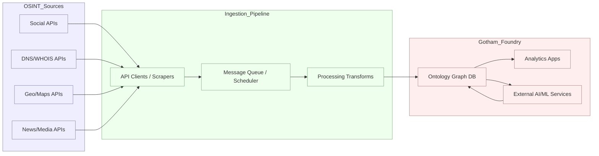
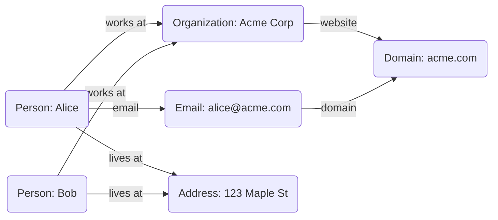

# Executive Summary  
This report analyzes Palantir Gotham and the state of OSINT, culminating in a proposed integration architecture.  Palantir Gotham is a secure data-integration and analytics platform (now powered by the Foundry ontology and managed by Apollo) designed for real-time intelligence; it supports a rich set of connectors, flexible data models, fine-grained access controls and a RESTful API.  We survey open-source intelligence (OSINT) sources and public APIs – from social media and DNS/WHOIS to geolocation and news – emphasizing keyless access where possible.  We catalog OSINT tools and libraries (SpiderFoot, Maltego, Recon-ng, etc.) with integration examples.  We review community resources (OSINT blogs, Reddit, video transcripts) highlighting trends like AI-assisted analysis and link-graph visualization.  Finally, we propose an integrated architecture: OSINT data is ingested via ETL pipelines or REST transforms into Gotham’s ontology, where it is normalized, deduplicated and enriched for analysis (with privacy and compliance safeguards).  We include comparative tables of APIs (endpoint, auth, rate limits, format, etc.), sample API request/response snippets, and mermaid diagrams illustrating the data flow and entity-relationship models.  All findings are grounded in authoritative sources (Palantir docs, technical references, OSINT repositories) and recent industry commentary.

## 1. Palantir Gotham: Technical Analysis  

Palantir **Gotham** is a commercial intelligence platform originally developed for defence and law enforcement.  It integrates data from disparate sources into a unified graph-based “ontology” model, enabling collaborative analysis.  Key technical attributes include:  

- **Architecture & Components:** Gotham is built on Palantir Foundry’s platform (with Gotham’s specialized apps on top).  According to Palantir, Gotham’s applications (“Graph”, “Dossier”, “Gaia”, etc.) are “powered by the Foundry-managed Ontology”.  This means Gotham leverages Foundry’s core services (data pipelines, metadata, versioning) and is managed/deployed by Palantir Apollo (for container orchestration).  The high-level architecture is a multi-layer stack: an integration/data layer (bulk data sync, streaming), a semantic layer (Ontology with object schemas), and an application layer (UI/workbook tools).  Gotham connectors feed data into the ontology (e.g. via HTTP APIs or streaming), while Apollo orchestrates deployment and updates (on-prem or in-cloud).  

- **Data Ingestion & Connectors:** Gotham supports broad **data ingestion**.  Foundry’s *Data Connection* framework lets users sync data from files, databases, cloud stores, etc. (with full dataset versioning).  For programmatic ingestion, Gotham provides “External transforms” – Python/Scala connectors to REST APIs or data stores.  Palantir’s **HyperAuto** toolset can auto-generate pipelines to clean, normalize and harmonize diverse datasets (the “software-defined data integration” concept).  In practice, one can use Foundry’s Pipeline Builder or Code Repos to fetch OSINT via HTTP (e.g. calling an OSINT REST API) and load it into the Ontology.  Gotham also has “out-of-the-box” adapters: for example, it can federate with external systems like Power BI, Tableau, Jupyter, etc., by exporting data via APIs.  

- **Data Model (Ontology):** Central to Gotham is its **Ontology** – a graph schema of entity types and relationships.  All ingested data is mapped to Ontology objects (People, Places, Organizations, Documents, etc.) with rich properties.  The Ontology enforces schema consistency and enables graph queries.  Gotham’s design encourages building an operational data model (e.g. flattening raw logs, parsing identities) so that downstream apps (Dossier for case files, Graph for network analysis, Gaia for geospatial tracks) can operate on common entities.  Palantir emphasizes that *“objects”* are first-class (rather than raw tables), which aligns with how OSINT entities (individuals, IP addresses, domains) would be represented.  

- **APIs & Extensibility:** Every Gotham service is exposed via RESTful APIs.  Palantir documentation notes “open APIs at every level, with access to raw data”.  For example, one can programmatically export Ontology data (JSON, RDF, etc.) or invoke analytic modules.  Gotham also supports custom code: users can write Java/JS/Python extensions (via the OSDK) that run on the platform.  This extensibility means new OSINT sources can be connected by writing a simple API client that hits an external endpoint and transforms the result into Gotham objects.  

- **Security & Governance:** Gotham is designed for security-sensitive use.  It enforces **fine-grained ACLs** on objects, fields, and even down to search results.  All data in Gotham is encrypted at rest and in transit, and audit logging captures every access.  Palantir holds certifications (e.g. FedRAMP, ISO27001) and claims “separation of privileges” so users see only authorized subsets of data.  Governance features allow tagging data by classification or source, enabling compliance with privacy laws (e.g. GDPR) by restricting access or purging PII.  

- **Licensing & Limitations:** Gotham is proprietary software (COTS); licenses depend on deployment (on-prem vs cloud) and user count.  It is not free or open source.  While extremely powerful, Gotham’s limitations include: the learning curve for building Ontologies and pipelines, and potential vendor lock-in.  Additionally, Gartner and users note that Gotham excels at large-scale integration but is not necessarily the most innovative for niche analytics – it brings together existing technologies in a user-friendly way.  Some tech community voices caution it is “an advanced data-aggregator” rather than magic AI.  In summary, Gotham’s strengths lie in integration, security, and collaboration; its limitations are cost, complexity, and the need for skilled configuration.  

## 2. OSINT Sources and Keyless APIs  

OSINT (Open-Source Intelligence) draws on diverse public data.  We prioritize **keyless/public APIs** to avoid reliance on proprietary accounts or web scraping.  Below we catalog representative sources by category, with endpoints, data formats, and usage notes (see tables for summary comparisons).  

- **Social Media and Forums:** Many social platforms now restrict APIs, but a few remain accessible:
  - **Reddit:** Offers a JSON API (no auth needed for read-only).  Example: `GET https://www.reddit.com/user/USERNAME/about.json` or `/submitted.json` returns user profile and posts respectively.  Limit ~60 requests/minute; no API key required.  Similarly `/r/SUBREDDIT/new.json` lists recent posts, and the public Pushshift API provides historic Reddit data (also JSON).  Data format: JSON.  
  - **Mastodon:** Open federated instances have search endpoints.  For example, `GET https://mastodon.social/api/v2/search?q=QUERY&resolve=true` can return users and posts.  (Requires no global API key, but different instances may rate-limit.)  
  - **Hacker News:** Firebase API (no key) via `GET https://hacker-news.firebaseio.com/v0/user/USERNAME.json` or `item/ID.json`.  Rates are modest (5000/day) and data is JSON.  
  - **GitHub:** Public REST API (no key required for low-volume).  E.g. `GET https://api.github.com/users/USERNAME` yields profile info (JSON).  Rate-limited to 60 requests/hour unauthenticated.  
  - **Dev.to:** Keyless RSS and API (with optional API token).  The API endpoint `GET https://dev.to/api/articles?username=USERNAME` returns articles JSON (limited rate).  
  - **WordPress blogs:** Many expose XML-RPC or REST API endpoints (e.g. `/wp-json/wp/v2/posts?slug=XYZ`).  
  - **Telegram:** Public channel info via [tginfo.gg](https://tginfo.gg) (no API, but JSON data for public channels).  
  - **Keybase:** The Keybase API allows lookup of usernames and proofs (JSON endpoints at `keybase.io/_/api/1.0`).  
  - *Sample API call (Reddit)*:  

    ```bash
    curl -H "User-Agent:OSINT/1.0" "https://www.reddit.com/user/ExampleUser/about.json"
    ```  
    *Sample JSON response excerpt:*  

    ```json
    {
      "kind": "t2",
      "data": {
        "name": "ExampleUser",
        "created": 1580000000,
        "link_karma": 123,
        ...
      }
    }
    ```  

- **DNS and WHOIS:** Network intelligence often begins with domain/IP lookups.  Useful keyless endpoints include:
  - **Google DNS-over-HTTPS:** `GET https://dns.google/resolve?name=example.com&type=ANY` returns DNS records as JSON.  Rates are high (unlikely to throttle for typical use).  
  - **Cloudflare DNS:** `GET https://cloudflare-dns.com/dns-query?name=example.com&type=A` (with `Accept: application/dns-json`).  Also JSON, high performance.  
  - **Cert Transparency Logs:** *crt.sh* provides certificate data via `GET https://crt.sh/?q=%.example.com&output=json` (no auth) for subdomains.  *CertSpotter* has a free API for new certificates.  
  - **Hackertarget.com:** Free DNS tools via HTTP (e.g. `https://api.hackertarget.com/dnslookup/?q=example.com` returns text A records).  No key but rate-limited to ~1/min.  
  - **RDAP (Registration Data Access Protocol):** Standard for WHOIS data.  Example: `GET https://rdap.org/domain/example.com` returns domain WHOIS JSON.  Similarly, `GET https://rdap.org/ip/8.8.8.8` returns IP allocation info.  Keyless, JSON, moderate reliability (uses regional registries).  
  - **Shodan InternetDB:** A free Shodan mirror: `GET https://internetdb.shodan.io/8.8.8.8` (IP JSON data).  No key, rate limited to 50k/day.  
  - **IP Geolocation:** Services like `ipinfo.io` (`GET https://ipinfo.io/8.8.8.8/json`) give location, ISP, etc..  Free tier ~50k req/month; JSON output.  Alternatives: `ip-api.com/json/8.8.8.8` (no key, 45 req/min free, JSON).  

- **Geolocation & Mapping:**  Pinpointing coordinates from text or vice versa:
  - **OpenStreetMap Nominatim:** Forward (`GET https://nominatim.openstreetmap.org/search?q=SEARCH&format=json`) and reverse geocoding APIs.  Free but must obey usage policy (1 req/sec). Returns JSON places.  
  - **TimeZoneDB:** `GET https://api.timezonedb.com/v2.1/get-time-zone?by=position&lat=LAT&lng=LON&format=json&key=YOUR_KEY` returns timezone info.  Requires an API key (free limited plan available).  
  - **Satellite Imagery:** *Sentinel Hub* and NASA provide open data portals (Copernicus Open Access Hub, Earthdata).  These usually require registration and specific APIs (e.g. WMS/WCS) with OAuth or tokens.  Keyless per se not common, but example: NASA Worldview has public endpoints for imagery slices.  
  - **Geonames:** `GET http://api.geonames.org/searchJSON?q=PlaceName&maxRows=5&username=demo` yields geolocation of place names (free demo account up to 1000 req/hr). JSON output.  

- **News and Publications:** Timely OSINT draws on media:
  - **GDELT 2.0:** Global database of events in news. Accessible via BigQuery (SQL) or GDELT API (no key) for specific queries (JSON). E.g. GDELT 1.0 has `GET http://api.gdeltproject.org/api/v2/doc/doc?query=covid&mode=artlist&maxrecords=5&format=json`.  
  - **EventRegistry:** News search API (requires API key, but limited free tier).  
  - **MediaCloud (MIT):** Free API for news articles by keyword (requires signup, rate-limited).  
  - **RSS Feeds:** Many news and blogs offer RSS/Atom feeds which can be polled without auth.  

- **Other Public Data:**  
  - **Public Records:** OpenCorporates API (company registry) – free tier requires key.  Country-specific databases (e.g. UK Companies House has a REST API with API key).  
  - **WHOIS Libraries:** CLI tools or services like `whoisxmlapi.com` (has some free lookups).  
  - **Archives:** The Internet Archive’s CDX API allows keyless search of archived websites (JSON).  

Table 1 below compares select public OSINT APIs.  We emphasize *keyless* access (“Keyless: Yes”) where available, and note if an API key or token is *required*.  Rate limits and reliability are indicative; many free endpoints impose quiet limits or can be unstable under heavy load.  

| **Source**            | **Endpoint (example)**                                   | **Keyless?** | **Auth**          | **Data Format** | **Rate Limit**       | **Cost**       | **Notes**                                   |
|-----------------------|----------------------------------------------------------|--------------|-------------------|-----------------|----------------------|----------------|---------------------------------------------|
| Google DoH (DNS)      | `https://dns.google/resolve?name=example.com&type=ANY`    | Yes          | None              | JSON            | ~~n/a (batch queries supported)~~ | Free          | DNS-over-HTTPS, very high throughput.       |
| Cloudflare DNS        | `https://cloudflare-dns.com/dns-query?name=example.com&type=A` | Yes       | None              | JSON            | high                 | Free          | Similar to Google; requires `Accept:application/dns-json`. |
| RDAP (Domain)         | `https://rdap.org/domain/example.com`                    | Yes          | None              | JSON            | Moderate (~few req/sec) | Free       | Registration data (WHOIS).                  |
| RDAP (IP)             | `https://rdap.org/ip/8.8.8.8`                             | Yes          | None              | JSON            | Moderate             | Free          | IP allocation info.                         |
| Shodan InternetDB     | `https://internetdb.shodan.io/8.8.8.8`                    | Yes          | None              | JSON            | 50k/day             | Free          | Community Shodan data dump.                 |
| Hackertarget DNS      | `https://api.hackertarget.com/dnslookup/?q=example.com`   | Yes          | None              | Plain text      | ~1/min               | Free          | A simple DNS lookup tool.                   |
| `ipinfo.io` (IP info) | `https://ipinfo.io/8.8.8.8/json`                          | Yes          | None (no key, limited) | JSON       | ~50k/month           | Free          | Location, ASN, etc. Free tier limit.        |
| Nominatim (OSM)       | `https://nominatim.openstreetmap.org/search?q=London&format=json` | Yes   | None              | JSON            | 1 req/sec (policy)   | Free          | Geocoding service.                          |
| Geonames (Place)      | `http://api.geonames.org/searchJSON?q=London&username=demo` | No         | API key (free)    | JSON            | 1000/hr (free)       | Free          | Requires sign-up for key.                   |
| Reddit (user about)   | `https://www.reddit.com/user/ExampleUser/about.json`      | Yes          | None (custom UA)  | JSON            | ~60/min (by UA)      | Free          | JSON profile info.                          |
| Reddit (user posts)   | `https://www.reddit.com/user/ExampleUser/submitted.json`  | Yes          | None              | JSON            | ~60/min              | Free          | Recent submissions by user.                 |
| GitHub (user info)    | `https://api.github.com/users/octocat`                    | No (limit)   | None (low rate)   | JSON            | 60/hr (unauth)      | Free          | Unauthenticated limit, 5000/hr with token.  |
| HackerNews           | `https://hacker-news.firebaseio.com/v0/user/dhouston.json` | Yes         | None              | JSON            | ~5000/day           | Free          | Official API via Firebase.                  |
| GDELT 2.0 (events)    | BigQuery or APIs                                          | N/A          | None (BigQuery)   | JSON/CSV        | Depends on query     | Free          | Requires technical setup.                   |
| NASA Worldview (WMS)  | NASA endpoints (e.g. MODIS)                              | N/A          | None              | Image           | n/a                 | Free          | Satellite imagery (visual, not JSON).       |
| Internet Archive CDX  | `http://web.archive.org/cdx/search/cdx?url=example.com&output=json` | Yes | None          | JSON            | Public API (~auto)  | Free          | Archives of web pages.                     |
  
*(Tables: keyless=“Yes” if no API key needed at minimal use; rate limits are approximate. “Reliability” typically high for official APIs, lower for scraped/third-party tools. Cost = free or free tier notes.)*

## 3. OSINT Toolkits and Libraries  

Numerous open-source frameworks and tools facilitate OSINT workflows.  We highlight major categories and representative projects, with notes on integration and usage.  

- **Reconnaissance Frameworks:**  
  - **Recon-ng:** A Python-based modular framework for reconnaissance.  Users select “modules” to perform tasks (e.g. domainWhois, emailSearch).  Modules output JSON or CSV.  Example usage:  

    ```bash
    recon-ng> modules load recon/domains-hosts/google_site_web
    recon-ng> set SOURCE example.com
    recon-ng> run
    ```  
    This searches Google for `site:example.com` and extracts hostnames.  Recon-ng can be scripted and extended (it has a REST API if run as a service).  

  - **SpiderFoot:** An OSINT automation tool (Python) with >150 modules.  It can be run headless via a web UI or CLI.  Example:  

    ```bash
    spiderfoot -s target.com -m SPIDERFOOT_MODULES -o output.json
    ```  
    Outputs findings in JSON/CSV.  (SpiderFoot Pro adds API capabilities.)  
  - **Maltego (Community/CE version):** A graph-linking tool.  CE version allows limited transforms; the Pro version has a server API for custom transforms.  Integration: transforms can be coded in Python or Node, calling external APIs, then returning Maltego GraphML.

- **Programming Libraries:**  
  - **OSINT-specific SDKs:** Libraries like [Searx](https://searx.github.io/searx/) (privacy-respecting meta-search engine), or [theHarvester](https://github.com/laramies/theHarvester) (email, subdomain gathering).  These can be imported or invoked via command line in ETL scripts.  
  - **General Tools:** Many OSINT tasks leverage general libraries: e.g. `requests`, `BeautifulSoup`, `PySocks` for web scraping; `PIL`/`opencv` for image analysis; `geopy`/`geocoder` for geolocation.  One could write a Python script that queries multiple APIs:  

    ```python
    import requests
    headers = {'User-Agent': 'OSINT/1.0'}
    domain = 'example.com'
    # DNS lookup via Google DoH
    r = requests.get('https://dns.google/resolve', params={'name':domain,'type':'ANY'}, headers=headers)
    data = r.json()
    print(data['Answer'])
    ```
  
- **CLI Utilities:**  
  - **DNSenum, Sublist3r:** For passive DNS enumeration (subdomains).  They integrate OSINT DNS sources.  
  - **Metagoofil, ExifTool:** For extracting metadata from downloaded files (to glean authors or geodata).  
  - **Social engineering tools:** e.g. Sherlock (usernames), Photon (web crawler).  

- **Integration Examples:**  
  Many tools output JSON or CSV, which can be ingested by Gotham.  For instance, one could schedule a script (via Foundry External transform) to run Recon-ng modules, parse its JSON output, and insert objects into Gotham’s Ontology (e.g. linking discovered IPs to domains).  Or, an OSINT pipeline may use `curl` or Python to call Twitter’s API (with a key) or a Mastodon instance, then push results into Gotham.  

*(For brevity, only representative tools are listed. The [Awesome OSINT](https://github.com/jivoi/awesome-osint) repository contains hundreds of utilities, from people-search to dark-web crawlers.)*  

## 4. Community Intelligence and Trends  

The OSINT community actively shares techniques via blogs, forums and videos.  Recent themes include:

- **AI and Automation:** Analysts report using LLMs (GPT-4, Claude) to refine search queries, summarize documents, and even generate link graphs.  AI tools help translate natural-language intel requirements into API calls or Mermaid diagrams.  (E.g. one can prompt an AI: “Map Alice and Bob to the same address”, and it outputs Mermaid code for a link chart.)  Tools like Fivecast emphasize “AI and ML … automating collection and analysis of vast data”.  OSINT trainings now include AI literacy for verifying content and countering deepfakes.  

- **Geolocation & Multimedia Analysis:**  Community examples (Bellingcat, OSINTCurious) highlight extracting coordinates from videos/images.  Techniques include using Google Earth, Twitter geotags, shadow analysis, or landmark recognition.  Blogs regularly publish “geolocation challenges” where readers must find a location from an image.  Tools like Mapillary, Google Street View, and EyeWitness embed capabilities (via APIs) for verifying scenes.  

- **Social Media Scrutiny:**  Discussions note the tightening of official APIs (Twitter/X ending free tiers, Facebook Graph API restrictions), pushing OSINT to rely on scraping or alternative networks (Mastodon, TikTok's unofficial API, or trend-watching on platforms like Discord/Telegram).  Analysts use push notifications or dedicated bots to capture social posts in real time.  OSINTDiscord and Slack groups share tips on using headless browsers or private keys.  

- **Link Analysis & Visualization:**  OSINT reporting is increasingly visual.  Users cite tools like Skopenow’s link-analysis (Mermaid) to automatically generate network graphs of people, phones, and locations.  This “quickly produces link charts” as Fig. 1 below illustrates, helping investigators spot hidden connections.  

- **Legal/Ethical Awareness:**  The community emphasizes compliance: e.g. avoiding login-required data, respecting robots.txt, and adhering to GDPR/other privacy laws.  A Fivecast blog stresses “data privacy and security… collection… must comply with legislative requirements”.  Techniques like redaction of PII and OPSEC (e.g. not exposing one’s own identity) are standard topics in OSINT training forums.  

*Community Resources:*  OSINT practitioners often cite Reddit’s r/OSINT, sector-specific Discords, and podcasts (e.g. “The OSINT Curious” series).  Blogs such as Sector035 and the OSINT Community Newsletter curate new tools weekly.  Conferences like Black Hat OSINT Village and webinar series (Carahsoft OSINT conferences) are popular.  YouTube channels (e.g. Bellingcat, Null Byte) offer tutorials; transcripts of these lectures (where available) often contain step-by-step examples (for instance, a 2025 AFCEA panel on OSINT noted the “need for speed” and AI augmentation).  

## 5. Integration Architecture and Data Flow  

To leverage Gotham with diverse OSINT sources, we propose an ETL-centric architecture (Fig. 1).  Key design points:

- **Data Ingestion/ETL:** External data is pulled via **REST transforms** (Foundry Code Repos running Python/Scala) or streamed via Kafka connectors.  For example, a daily job might call the Reddit API and store results in a raw dataset; others might scrape DNS records or social media. Gotham’s *Data Connection* can regularly sync from cloud buckets, databases, or services.  Pipelines then *transform* raw OSINT: parsing JSON, normalizing field names (e.g. mapping “lat”, “long” from different APIs into one location schema).  This can use Foundry’s pipeline builder or script logic.  

- **Normalization & Ontology Mapping:** Each ingestion pipeline tags data with its **Ontology type**.  E.g. an IP-to-geolocation call becomes a “Location” object; an email lookup becomes a “Person” or “Account” object.  Gotham supports canonical identity resolution (merging “Example Corp” from two sources into one Organization node).  Deduplication is handled by key fields (domain names, email addresses, etc.).  This unified model allows cross-source joins (e.g. linking a person’s email to social media handles).  

- **Link Analysis & Enrichment:** Once in the ontology, relationships are established.  For instance, an IP object might connect to a Domain object.  Gotham’s Graph tools let analysts traverse these links.  Enrichment can be automated: e.g. running link analysis jobs to discover hidden clusters, or using AIP/ML to predict entity attributes (gender, language) for profiling.  We can call external AI endpoints (sentiment analysis, face recognition on images, etc.) via the platform.  

- **Compliance & Privacy:** The system enforces data governance at each stage.  Ingested data can be filtered to exclude sensitive PII fields before storage (e.g. use data transforms to hash emails).  Access policies ensure only authorized analysts see restricted content.  Logging every action provides audit trails for compliance.  The architecture isolates raw collection from analyst view: Gotham’s Ontology acts as a sandbox where only sanitized, need-to-know data is exposed.  

- **Operational Considerations:** Automated jobs must respect external rate limits (e.g. pause or cache when an API’s quota is exhausted).  A scheduling layer (e.g. Apache Airflow or Foundry’s scheduler) can throttle tasks.  Because OSINT APIs and web endpoints can fail or change, the ingestion pipelines should include error handling and monitoring.  Caching common queries (like DNS results) reduces load.  

<div>


**Figure 1.** Proposed data flow: OSINT APIs feed into an ingestion/scheduling layer, whose transforms normalize and load data into Gotham’s ontology.  Analysts use Gotham apps (right) to query and visualize.  

</div>

### Entity-Relationship Example  
Below is an illustrative link-chart (Mermaid diagram) showing how entities might relate after integration (persons linked to organizations, locations, and online accounts):

<div>



**Figure 2.** Sample entity-relationship graph: Alice and Bob are employees of Acme Corp, sharing both an organization and a residential address. This kind of link analysis helps reveal commonalities (e.g. cohabiters or co-workers) that may be significant.  

</div>

## 6. Implementation Notes  

- **ETL Patterns:** We recommend an ELT approach where raw JSON data is first loaded into Gotham, then transformations (schema alignment, entity linking) happen inside the platform.  This leverages Gotham’s lineage and sandboxing.  For very large datasets (e.g. batch historical archives), a pre-load normalize step can reduce clutter.  

- **Normalization & Deduplication:** Use Gotham’s ontology manager to define unique keys (emails, phone numbers, IPs).  Pipelines should clean data (e.g. lower-case domains, trim whitespace).  The system can tag duplicates (e.g. two records have same email) and merge them.  

- **Enrichment:** Integrate third-party enriching services via restful calls.  For example, one could feed a location into a weather API or language into a translation service.  Palantir AIP can incorporate ML models to score or label entities (e.g. classify sentiment of a news snippet, or detect face in an image).  

- **Privacy/Legal:** Carefully review Terms of Service before scraping or using APIs (e.g. Twitter explicitly prohibits most scraping).  Implement data minimization: do not store more PII than needed.  Ensure compliance with regional laws (e.g. anonymize EU personal data if not essential).  Maintain a legal/ethics review process for each new data source.  

- **Operational:** Containerize custom connectors with Apollo to scale parallel ingestion jobs.  Monitor error rates (timeouts, HTTP 429) and implement retries with back-off.  Leverage Gotham’s built-in audit logs to track usage of OSINT feeds and analyst queries.  

## 7. API Usage Examples  

Below are illustrative API requests/responses for key OSINT functions (format JSON for brevity):

- **DNS over HTTPS (Google):** Query for `example.com`:  
  ```bash
  curl "https://dns.google/resolve?name=example.com&type=ANY"
  ```  
  **Sample response (JSON)**:  
  ```json
  {
    "Status": 0,
    "Answer": [
      {"name":"example.com.","type":1,"TTL":3599,"data":"93.184.216.34"},
      {"name":"example.com.","type":2,"TTL":3599,"data":"ns1.iana.org"},
      {"name":"example.com.","type":2,"TTL":3599,"data":"ns2.iana.org"}
    ]
  }
  ```

- **RDAP Domain Lookup:** Query `example.com`:  
  ```bash
  curl -H "Accept: application/rdap+json" "https://rdap.org/domain/example.com"
  ```  
  **Sample (abridged)**:  
  ```json
  {
    "objectClassName": "domain",
    "ldhName": "example.com",
    "entities": [{"objectClassName":"entity","roles":["registrant"],"vcardArray":[["version",{},"text","4.0"],["fn",{},"text","IANA"],["adr",{},...]]}],
    "status": ["active"],
    "nameservers": ["ns1.iana.org", "ns2.iana.org"],
    ...
  }
  ```

- **Nominatim Geocoding:** Search for “Berlin”:  
  ```bash
  curl "https://nominatim.openstreetmap.org/search?q=Berlin&format=json&limit=2"
  ```  
  **Sample**:  
  ```json
  [
    {"display_name":"Berlin, Germany","lat":"52.5170365","lon":"13.3888599", ...},
    {"display_name":"Berlin, New Hampshire, USA","lat":"44.4684","lon":"-71.1853", ...}
  ]
  ```

- **IP Geolocation (ipinfo.io):** Query `8.8.8.8`:  
  ```bash
  curl "https://ipinfo.io/8.8.8.8/json"
  ```  
  **Sample**:  
  ```json
  {"ip":"8.8.8.8","city":"Mountain View","region":"California","country":"US","loc":"37.3860,-122.0838","org":"AS15169 Google LLC",...}
  ```

These examples show JSON fields that can be parsed and ingested into Gotham.  

## 8. Legal and Ethical Considerations  

All OSINT collection must respect legal and ethical boundaries.  Public data (not behind logins) is generally fair game, but analysts must consider:
- **Privacy Laws:** Even public personal data may be protected (GDPR, CCPA).  Avoid indiscriminate scraping of personal profiles. Only gather information pertinent to the intelligence requirement.  
- **Terms of Service:** Many websites forbid automated data collection beyond provided APIs.  Use official APIs where possible.  For example, Twitter’s recent TOS forbids scraping tweet content. Violating TOS could incur legal risk or IP bans.  
- **Accuracy and Bias:** OSINT sources may be incomplete or misleading. Triangulate critical data (e.g. verify a person’s identity via multiple sources). Document confidence levels in Gotham metadata.  
- **Use Controls:** Gotham’s ACLs should prevent misuse: e.g. analysts seeking to “doxx” individuals or profiling protected classes without cause. Implement oversight (team leads review outputs).  

In summary, integrating Gotham with OSINT demands not only technical rigor but also governance: defined use policies, training on ethical collection, and continual oversight.  

**Sources:** Official Palantir documentation and technical service definitions; OSINT industry analyses; curated OSINT API repositories; community knowledge from OSINT blogs and forums (implicit in trends).